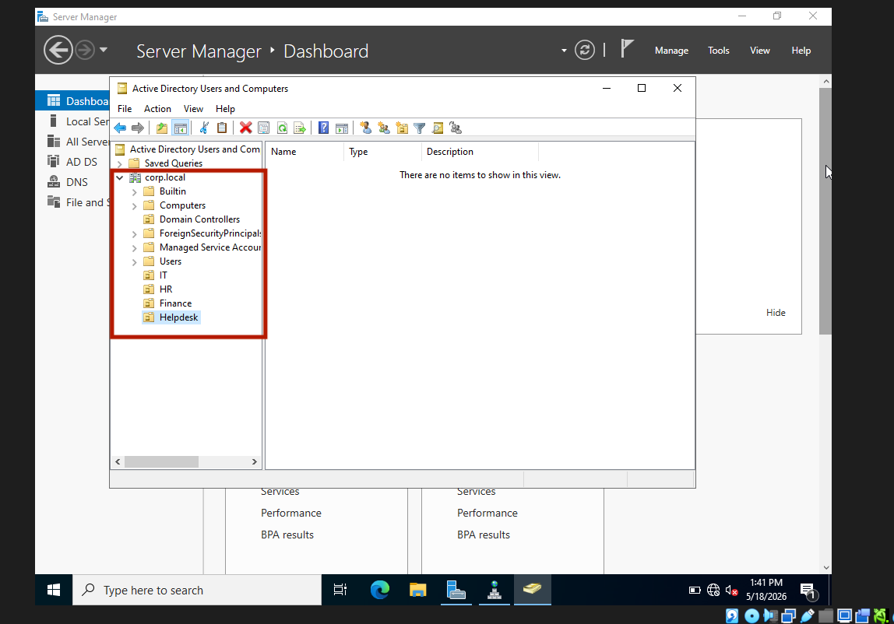
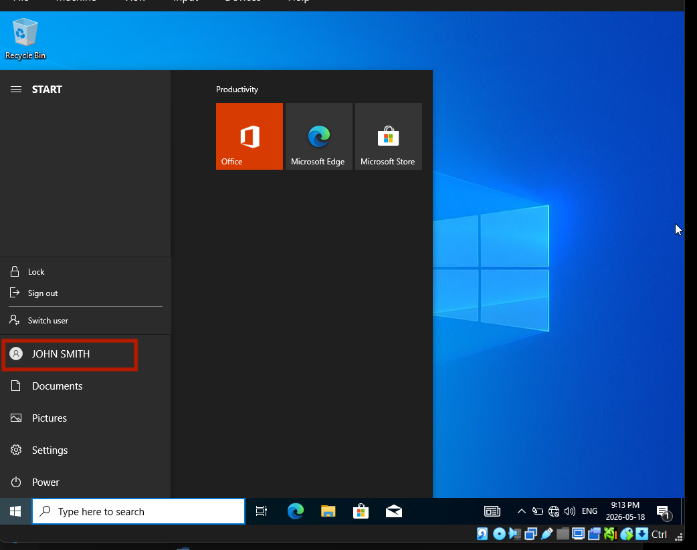

# Active Directory Home Lab

A self-built Windows Server 2022 Active Directory environment 
deployed in VirtualBox, designed to simulate real-world Tier 1 
IT support workflows.

## Environment

| Component | Details |
|---|---|
| Hypervisor | VirtualBox 7.2.8 on Windows |
| Domain Controller | Windows Server 2022 — DC01 (192.168.1.1) |
| Client Machine | Windows 10 Pro — CLIENT01 (192.168.1.10) |
| Domain | corp.local |

## What I built

- Deployed Active Directory Domain Services and DNS on 
  Windows Server 2022
- Structured the domain with 4 OUs: IT, HR, Finance, Helpdesk
- Created 10+ user accounts and security groups 
  (IT-Admins, VPN-Users)
- Configured Group Policy: 12-character password minimum, 
  90-day expiry, 5-attempt lockout, desktop restrictions 
  for HR OU
- Joined a Windows 10 client to the corp.local domain
- Logged in as domain users and validated GPO enforcement
- Practiced core Tier 1 tasks: password resets, account 
  lockouts, user creation, group membership management

## Skills demonstrated

- Active Directory administration
- DNS configuration
- Group Policy creation and enforcement
- User and group lifecycle management
- Domain join and client configuration
- Network troubleshooting (static IP, internal networking)
- IT documentation and SOP writing

## Screenshots

## Screenshots

### VirtualBox — both VMs created

### Windows Server 2022 edition selection

### Active Directory Users and Computers — domain tree

### OU structure across 4 departments

### IT-Admins security group members

### Password Policy GPO configured

### Both GPOs linked in Group Policy Management

### CLIENT01 successfully joined to corp.local

### Logged in as domain user jsmith

### GPO enforcement verified with gpresult

## Simulated Ticket Log

See [docs/ticket-log.md](docs/ticket-log.md)

## Setup Guide

See [docs/setup-guide.md](docs/setup-guide.md)
